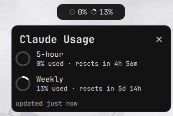
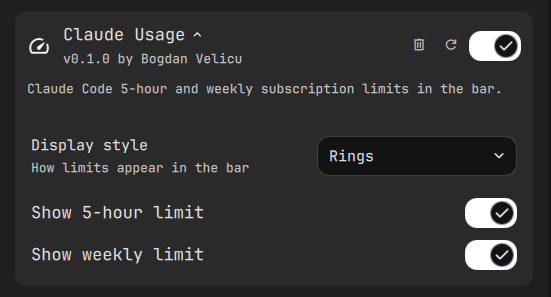

# DankClaudeUsage

A [DankMaterialShell](https://github.com/AvengeMedia/DankMaterialShell) DankBar widget that shows your **Claude Code subscription limits** — the rolling 5‑hour window and the weekly (7‑day) window — as theme‑colored rings with a detailed popout. Same numbers as Claude Code's `/usage`.

**Zero setup:** enable it and it works. It reads the OAuth token Claude Code already stores on your machine and queries Anthropic's usage endpoint directly — no statusline edits, no config wiring.

> Status: **0.1.0**, experimental. The DMS plugin API is itself experimental and may change between minor versions.

## What it looks like

Two bar styles, both using your active DMS theme palette (shifting
`primary → warning → error` as a limit fills):

- **Rings** — a progress ring per limit with the percentage in the center *(default)*
- **Numbers** — `✳ 15% · 4%`

Clicking the pill opens a popout with one row per limit, each showing the
percentage and a live "resets in …" countdown, plus an "updated Xm ago" footer.

<p align="center">
  
</p>

## How it works

```
~/.claude/.credentials.json (OAuth token)
        │
        ▼
fetch-usage.sh ──GET──▶ api.anthropic.com/api/oauth/usage ──▶ ~/.cache/dms-claude-usage.json ──▶ plugin (QML)
```

The widget runs the bundled `fetch-usage.sh` on a timer. The script reads the
access token Claude Code maintains in `~/.claude/.credentials.json`, calls the
usage endpoint (the same one `/usage` uses), normalizes the response, and writes
a small cache file the widget renders. A short freshness guard means multiple
monitors share one network call per interval. Reset countdowns tick client‑side.

**Privacy/security:** the token never leaves your machine except in the request
to `api.anthropic.com` — exactly where Claude Code itself sends it. The widget
only reads the token; it never writes credentials.

**When it can't fetch:** if Claude Code isn't signed in, or the token has expired
and no recent `claude` run has refreshed it, the popout says so and the widget
keeps showing the last values. Running Claude Code refreshes the token
automatically.

## Requirements

- DankMaterialShell with the plugin system (`requires_dms >= 0.1.0`)
- `jq` and `curl`
- Claude Code signed in on a Pro/Max plan (`claude` → `/login`)

## Install

```bash
git clone https://github.com/<you>/DankClaudeUsage ~/Projects/DankClaudeUsage

ln -sfn ~/Projects/DankClaudeUsage/plugins/claudeUsage \
        ~/.config/DankMaterialShell/plugins/claudeUsage
```

Then in DMS: **Settings → Plugins → Scan**, enable **Claude Usage**, and add it
to a DankBar section (**Settings → DankBar Layout**). That's it — it starts
showing usage within a few seconds.

## Settings

| Setting | Default | Notes |
|---|---|---|
| Display style | Rings | rings (% in the center) or numbers (`✳ 15% · 4%`) |
| Show 5‑hour limit | on | |
| Show weekly limit | on | |

Rings shift `primary → warning → error` as a limit fills. The thresholds (70/90),
refresh interval (5 min), and stale window (1 h) are named constants at the top of
`ClaudeUsageWidget.qml` / `ClaudeUsageData.qml` — tweak them there if you like.

<p align="center">
  
</p>

## Cache format

```json
{
  "captured_at": 1781090000,
  "five_hour":  { "used_percentage": 15, "resets_at": 1781091000 },
  "seven_day":  { "used_percentage": 4,  "resets_at": 1781575200 }
}
```

`resets_at` is Unix epoch seconds.

## Development & tests

```bash
sh tests/test-fetch.sh      # fetch-usage.sh: response normalization, error handling (no network)
sh tests/test-manifest.sh   # plugin.json validity
```

`tests/test-fetch.sh` exercises the normalization against
`fixtures/oauth-usage-sample.json` via the script's `CLAUDE_USAGE_MOCK` hook, so
it never hits the network. The QML widget is verified by loading it in a DMS
instance (see `docs/superpowers/` for the design and build plan).

## License

MIT — see [LICENSE](LICENSE).
